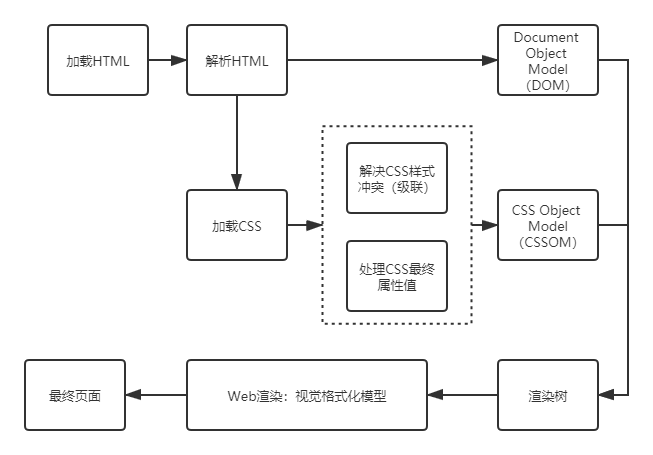

# 前言
首先来看web页面渲染过程：



其中的视觉格式化模型就是这节讨论的重点

## 视觉格式化模型

> 视觉格式化模型是为渲染树中的每个元素计算框并确定这些框的布局的算法，以确定页面的最终布局

包含以下属性：

- 盒子宽度：盒子模型
- 盒子类型：inline、block、inline-block
- 布局：floats和positioning
- 层叠上下文
- 渲染树中其他元素
- viewport大小、图片宽度等

### 盒模型

盒模型是CSS最基本的部分，很大程度决定了元素在页面上怎么布局的。

盒模型元素可以看作是一个矩形，具有content、width、height、padding、margin和border属性，这些属性都是可选的。

- content：文字、图片等
- padding：环绕content的透明区域，在盒模型内部
- border：环绕content和padding
- margin：盒子之间的空隙
- fill area：被背景颜色和背景图片充满的区域

> total width = right border + right padding + specified width + left padding + left border 
>
> total height = top border + top padding + specified height + bottom padding + bottom border 

盒模型中有两种重要的box-sizing属性，border-box和content-box

### 盒子类型

#### block

```css
div {
    display: block
}
```

- 元素看上去像是块
- 继承父元素的100%宽度
- 垂直排布

#### inline

```css
div {
    display: inline
}
```

- 内容按行分布
- 仅占用内容的空间
- 没有换行
- 没有宽高
- padding和margin仅水平（左和右）

#### inline-block

```css
div {
    display: inline-block
}
```

- block和inline的混合
- 仅占用内容的空间
- 没有换行

### 布局

#### 正常

```css
div {
    position: relative
}
```

- 默认定位方案
- 不浮动
- 没有绝对定位
- 元素根据其源顺序进行布局

#### 浮动

```css
div {
    /*float: left;*/
    float: right;
}
```

- 元素从正常布局中移除
- 文本和内联元素将围绕浮动元素
- 容器不会根据元素调整高度

### 绝对定位

```css
div {
    position: absolute;
    /*position: fixed;*/
}
```

- 元素从正常布局中移除
- 对周围的内容或元素没有影响
- 我们使用top，bottom，left和right将元素从其相对放置的容器中偏移

### 层叠上下文

