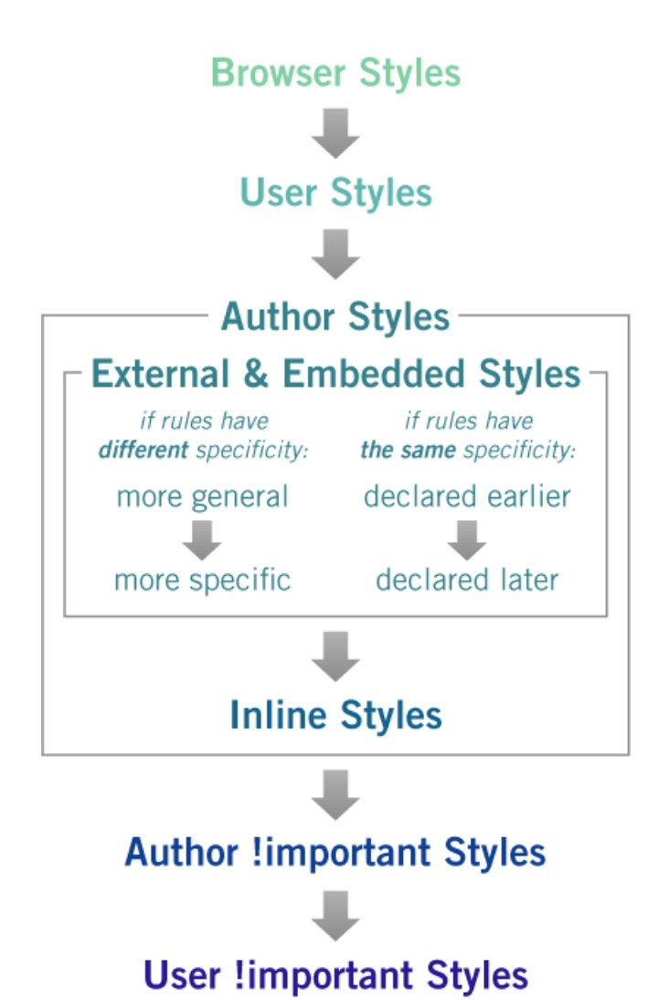

# 介绍
这一部分主要聚焦于css的解析过程的，分析css文件是如何被浏览器解析的

从一个最简单的css示例开始
```css
.my-class {
    color: blue;
    text-align: center;
    font-size: 20px;
}
```
这样的一个css模板由两个部分组成，即选择器和装饰块，选择器可以选择一个或多个html元素标签，装饰块中则通过设置css属性，来改变选择的元素标签样式
## 级联和独特性
### 级联
级联是融合不同样式和解决不同css装饰和规则之间冲突的过程，尤其是在多条css规则应用到一个元素的时侯

css样式来源不同，可以来源于引用的css文件，也可以来源于用户自己设定的css样式，并且浏览器自身也涵盖了一些默认css样式

当样式冲突时，css级联会按照一定规则去解析css，参考链接：https://doppelmutzi.github.io/css-basics/：

- 首先按照重要性：



- 其次是独特性：Inline styles>IDs>Classes, pseudo-classes,attribute>Elements,pseudo-elements

- 最后是源码，代码中最后的样式会覆盖之前所有样式并应用生效

###  独特性

### 注意！

- css样式中!important拥有最高优先级
- 但，尽量在代码最后使用。最好使用正确的specificity去维护代码
- 内联样式优先于css文件中样式
- 尽量使用id选择器而不是class，或element选择器

## css值解析过程

- 每个css属性有一个初始值，如果没有声明就默认为初始值
- 浏览器为每个页面设置默认字体大小（通常为16px）
- 百分值和相对值会被转化为px
- 如果指定了字体大小，则相对于其父元素的字体大小来计算百分值，如果指定了长度，则相对于其父元素的宽度计算百分值
- 如果指定了字体大小，则em相对于父元素字体大小进行计算；如果指定了长度，则em相对于当前字体大小进行测量
- rem始终相对于文档的根字体大小进行测量
- vh和vw只是视口的高度和宽度的百分比度量

## 继承

- 继承将某些特定属性的值从父元素传递给子元素，使代码可维护性高
- 继承了与文本相关的属性：字体系列，字体大小，颜色等
- 属性的计算值是继承的内容，而不是声明的值
- 仅当没有声明该属性的值时，该属性的继承才有效
- Inherit关键字强制对某个属性进行继承
- initial关键字将属性重置为其初始值