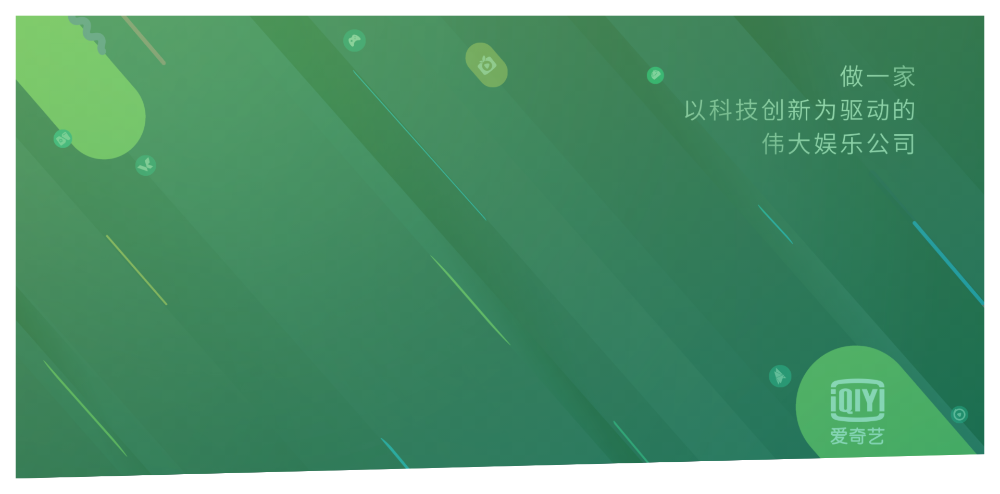

# 爱奇艺介绍页面
为什么在这里打广告，因为这个项目是我在这里实习的时候摸鱼做的......
## 页头构建（一）
在body中添加header标签，并赋于class=header
```html
<header class="header"></header>
```
首先设置全局css样式，使用css选择器对margin和padding属性设置，并设置全局盒模型
```css
* {
    margin: 0;
    padding: 0;
    box-sizing: border-box;
}

body {
    font-family: "Lato", sans-serif;
    font-weight: 400;
    font-size: 16px;
    line-height: 1.7;
    color: #777;
}
```
对于header标签设置样式
```css
.header {
    height: 95vh;
    background-image: linear-gradient(
            to right bottom,
            rgba(126, 213, 111, 0.6),
            rgba(40, 180, 133, 0.6)),
    url("../img/background.jpeg");
    background-size: cover;
    background-position: top;
}
```
为调整背景图片到四周边框的距离，为之前设置的body属性中添加padding属性
```css
body {
    font-family: "Lato", sans-serif;
    font-weight: 400;
    font-size: 16px;
    line-height: 1.7;
    color: #777;
    padding: 30px;
}
```
为实现背景图片的特殊形状这一特效图，如下所示：

我们引入css高级属性clip-path来实现
```css
.header {
    clip-path: polygon(0 0, 100% 0, 100% 90vh, 0 100%);
}
```
至此，背景图片的设置就全部完成

## 页头构建（二）
首先，向页面左上角添加logo图案，需要先在html文件中添加相应标签
```html
<header class="header">
    <div class="logo-box">
        
    </div>
</header>
```
接着设置logo的position
```css
.logo-box {
    position: absolute;
    top: 40px;
    left: 40px;
}
```
由于是绝对定位，所以需要设置一个相对定位的父元素，因此在header中添加position属性
```css
.header {
    position: relative;
}
```
然后设置logo这一class的属性
```css
.logo {
    height: 35px;
}
```
可以在浏览器中打开html文件，此时logo位置与样式已经设置完毕，那么接下来就向背景图片中添加文字了

还是老规矩，先修改html文件，在header标签下添加h1标签
```html
<h1 class="heading-primary">
    <span class="header-primary-main">简单文化</span>
    <span class="header-primary-sub">是爱奇艺的企业文化</span>
</h1>
```
并设置相应样式文件
```css
.heading-primary {
    color: #ffffff;
    text-transform: uppercase;
}

.header-primary-main {
    display: block;
    font-size: 60px;
    font-weight: 400;
    letter-spacing: 35px;
}

.header-primary-sub {
    display: block;
    font-size: 20px;
    font-weight: 700;
    letter-spacing: 20px;
}
```
此时文字呈上下排布，字体大小也与预期效果一致，值得注意的是，text-transform属性是针对英文的，将英文转换为大小写，这里是中文因此并不会起什么作用

要使文字居中排布，并且在文字下方加上按钮，还需要进一步修改，我们将按钮标签以及上述内容包裹
```html
<div class="text-box">
    <h1 class="heading-primary">
        <span class="header-primary-main">简单文化</span>
        <span class="header-primary-sub">是爱奇艺的企业文化</span>
    </h1>
</div>
```
对应的样式
```css
.text-box {
    position: absolute;
    top: 50%;
    left: 50%;
    transform: translate(-50%, -50%);
}
```
如果这个地方没有transform属性，是无法居中的，或者说只是text-box这个div的左上角所在的点居于屏幕中央

至此，页头构建部分就已结束
## 创建炫酷的css动画
首先看一个最简单的动画
```css
@keyframes moveInLeft {
    0% {
        opacity: 0;
        transform: translateX(-100px);
    }

    100% {
        opacity: 1;
        transform: translate(0);
    }
}
```
该动画可以使元素均速移动，以百分比来规定改变发生的时间，或者通过关键词"from"和"to"，等价于0%和100%，0%是动画的开始时间，100%动画的结束时间，为了获得最佳的浏览器支持，您应该始终定义0%和100%选择器

上述动画的效果为从左边100px的位置均匀移动到屏幕中央

使用该动画的方法十分简单，只需要定义动画属性即可，我们对class为header-primary-main的span标签应用该动画，即需要为该class添加属性
```css
.header-primary-main {
    animation-name: moveInLeft;
    animation-duration: 3s;
}
```
此时就可以在浏览器中查看动画效果，我们尝试将该动画复杂化一点，让元素先从左到右位移再从右位移到中央，即在80%的时候从右往左移动至中央，为了实现缓冲效果，位移应该小于之前
```css
@keyframes moveInLeft {
    0% {
        opacity: 0;
        transform: translateX(-100px);
    }

    80% {
        transform: translateX(20px);
    }

    100% {
        opacity: 1;
        transform: translate(0);
    }
}
```
类似的，对于另一端文字，我们可以添加相反的动画
```css
@keyframes moveInRight {
    0% {
        opacity: 0;
        transform: translateX(100px);
    }

    80% {
        transform: translateX(-10px);
    }

    100% {
        opacity: 1;
        transform: translate(0);
    }
}
```
对于css动画的引用，还可以用animation属性简写
```css
.header-primary-sub {
    animation: moveInRight 1s ease-out;
}
```
css会去解析对应的属性
## 打造复杂的动画按钮（一）
首先，创建按钮相应的html，我们将按钮排布在文字之下
```html
<div class="text-box">
    <h1 class="heading-primary">
        <span class="header-primary-main">简单文化</span>
        <span class="header-primary-sub">是爱奇艺的企业文化</span>
    </h1>
    <a href="#" class="btn btn-white">探索爱奇艺</a>
</div>
```
相应的，设置它的css样式
```css
.btn:link, .btn:visited {
    /*text-transform: uppercase;*/
    text-decoration: none;
    padding: 15px 40px;
    display: inline-block;
    border-radius: 100px;
    transition: all .2s;
}

.btn-white {
    background-color: #fff;
    color: #777;
}
```
为了使按钮居中，需要设置class为text-box的属性
```css
.text-box {
    text-align: center;
}
```
为了使按钮与文字位置不那么紧凑，还需要以下设置：
```css
.heading-primary {
    margin-bottom: 60px;
}
```
接下来就为按钮添加一些动画，当鼠标悬浮到按钮时，按钮会轻微上浮
```css
.btn:hover {
    transform: translateY(-3px);
    box-shadow: 0 10px 20px rgba(0, 0, 0, .2);
}
```
当鼠标点击按钮时，按钮轻微上浮，但上浮位移小于悬浮时的位移，因此每次点击就会出现真实点击感
```css
.btn:active {
    transform: translateY(-1px);
    box-shadow: 0 5px 10px rgba(0, 0, 0, .2);
}
```
## 打造复杂的动画按钮（二）
最后，为按钮添加另一个属性
```css
.btn::after {
    content: "";
    display: inline-block;
    height: 100%;
    width: 100%;
    border-radius: 100px;
    position: absolute;
    top: 0;
    left: 0;
    z-index: -1;
}

.btn-white::after {
    background-color: #fff;
}
```
CSS伪元素::after用来创建一个伪元素，作为已选中元素的最后一个子元素，通常会配合content属性来为该元素添加装饰内容，这个虚拟元素默认是行内元素

这里注意，既然设置了position为绝对定位，就要设置一个相对的父元素，我们设置按钮被点击或鼠标悬浮上时的状态为父元素
```css
.btn:link, .btn:visited {
    position: relative;
}
```
接着我们再添加一个动画，当鼠标悬浮到按钮上时按钮变大
```css
.btn:hover::after {
    transform: scaleX(1.4) scaleY(1.6);
    opacity: 0;
}
```
为了使动画效果平滑，再动画初始状态的元素中添加属性
```css
.btn::after {
    transition: all .4s;
}
```
最后，为按钮添加出场动画，避免属性冲突的话，最好为按钮再添加一个class，该class专门管理动画
```html
<a href="#" class="btn btn-white btn-animated">探索爱奇艺</a>
```
同样的，添加css样式
```css
.btn-animated {
    animation: moveInBottom .5s ease-out .75s;
    animation-fill-mode: backwards;`
}
```
